# WORKSHOP: Taller de desarrollo de aplicaciones multiplataforma con XAMARIN Forms


1.	Abrimos Visual Studio Community Edition y seleccionamos crear un nuevo proyecto móvil multiplataforma
2.	 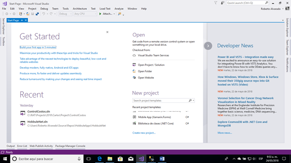
3.	O en su defecto en el menú File, New, Project…
4.	 
5.	Esto nos abre una nueva ventana.
6.	En la parte izquierda seleccionamos Cross Platform y en la parte central seleccionamos Xamarin Forms como aparece en la imagen siguiente:
7.	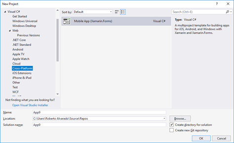
8.	 
9.	Colocamos el nombre de nuestra App en la casilla “Name” o nombre, si deseamos colocar los archivos de la aplicación en otra carpeta hacemos clic en el botón “Browse…” y seleccionamos la ruta del disco duro, luego presionamos el botón OK de la parte inferior derecha para iniciar el proceso de creación de la aplicación.
10.	Si seleccionamos el botón browse nos mostrara algo como esto:
11.	 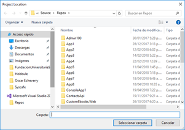
12.	Aquí ubicamos la ruta en nuestro disco duro en donde quedara el App.
13. 13.	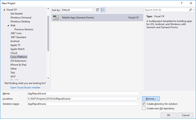 
14.	Damos clic al botón OK
15.	 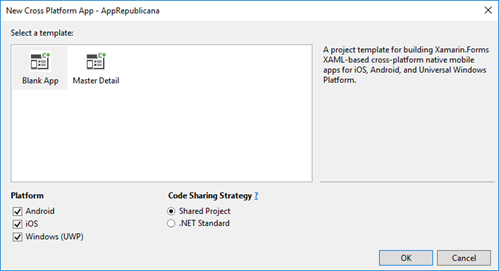
16.	Nos muestra la pantalla anterior aquí seleccionamos la estrategia de compartir el código, les recomiendo seleccionar .NET Standard y una aplicación en blanco como la selección de la pantalla y damos clic al botón OK
17.	 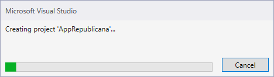
18.	Nos muestra una pantalla como esta, indicando que está trabajando, esto tardara unos minutos.
19.	Al finalizar nuestra pantalla será similar a esta:
20.	 
21.	A la derecha tenemos el Explorador de la solución arriba y la ventana de propiedades abajo, a la izquierda tenemos la ventana de código o de XAML. XAML es un lenguaje de marcado basado en XML que sirve para dibujar las pantallas en Xamarin Forms.
22.	La solución completa que se crea, se crea con 4 proyectos:
23.	 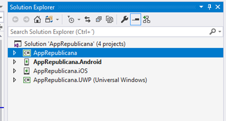
24.	EL primer proyecto es el proyecto compartido en donde vamos a colocar todo el código de nuestro App, los formularios o pantallas, etc.
25.	EL segundo proyecto es el proyecto Android, en este estará todo lo relacionado con esta plataforma.
26.	El tercer proyecto es el proyecto iOS, en este proyecto estará lo relacionado específicamente para esta plataforma.
27.	El cuarto proyecto es el proyecto UWP o de Windows 10, aquí estará lo relacionado a esta plataforma.
28.	Como se observa el proyecto Android está en negrita indicando que es el proyecto por defecto si lanzamos nuestra aplicación se iniciara el emulador de Android y se ejecutara nuestra aplicación en este emulador.
29.	 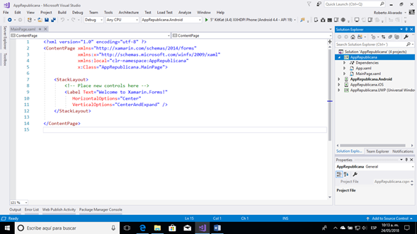
30.	En el explorador en el proyecto compartido o .NET Standard encontramos dos archivos. App.xaml, este archivo sirve para incluir o configurar el aspecto grafico de nuestra aplicación utilizando lo que se conoce como estilos. El archivo MainPage.xaml, es el archivo principal de nuestra aplicación que nos crea de manera automática Visual Studio, es el que aparece en la imagen, que solo contiene un Label que se centra tanto vertical como horizontalmente en la pantalla.
31.	Ejecutemos nuestra app y veremos que sucede. Para esto hacemos clic en la parte superior de la pantalla en donde indica el emulador de Android a ejecutar, este proceso puede tardar unos minutos dependiendo que la memoria dl PC, del procesador y de que tantas aplicaciones se estén ejecutando en el momento.
32.	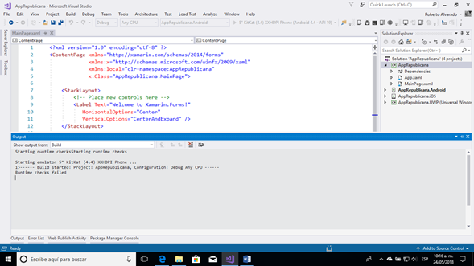
33. 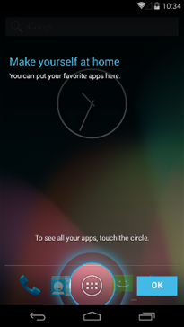
34. 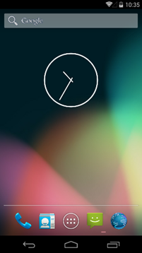
35.	Aquí carga el emulador de Android, después de presionar ok es la imagen de la derecha
36.	 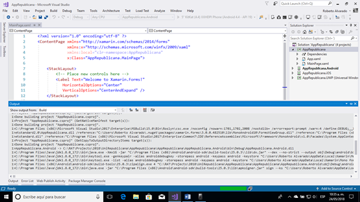
37.	En la pantala de visual studio vemos los avances del despliegue.
38.	 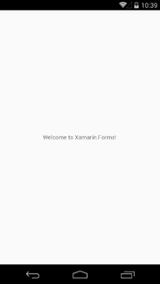
39.	Aquí ya está la aplicación ejecutándose en el emulador de Android, ahora vamos a ejecutar la misma aplicación en UWP.
40.	 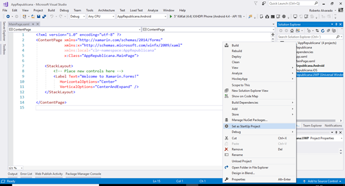
41.	Seleccionamos el proyecto UWP, damos clic derecho y en el menú, seleccionamos Set as StartUp Project para que ahora se ejecute el proyecto de Windows 10.
42.	 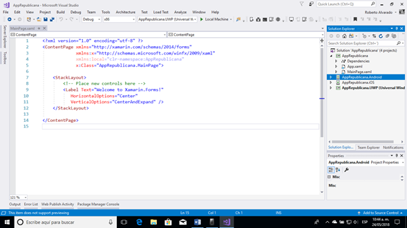
43.	Se observa que el proyecto queda en negrita. Para ejecutar damos clic en Local Machine como este seleccionado en el cuadro rojo de la imagen.
44.	Ahora se lanzará la aplicación en el Windows 10 con las mismas características.
45.	
46.	 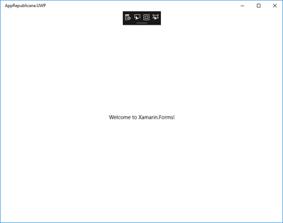
47.	Ahora vamos a crear una pantalla de inicio de sesión para nuestra aplicación.
48.	Regresamos a VS, y allí en la pantalla de MainPage.xaml, vamos a eliminar el contenido que tiene del label y vamos a crear nuevo código Xaml para dibujar nuestra app.
49.	Podemos adicionar una ventana de un visualizador de la pantalla, depende de la versión que este instalada, esto lo hacemos, dando clic en el menú View, Other Windows, Xamarin forms Previewer
50.	 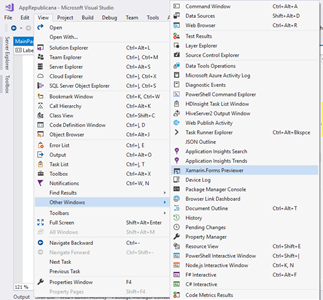
51.	Luego arrastramos la ventana y la anclamos en el sitio que más nos guste de nuestro IDE.
52.	El control StackLayout es un control que puede contener a otros y su comportamiento es apilarlos uno encima de otro de manera vertical, por defecto, este control también puede hacer lo mismo, pero de manera horizontal.
53.	 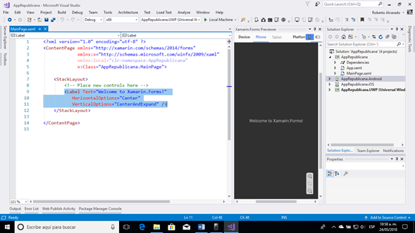
54.	Seleccionamos y eliminamos el control label
```<language>
55.	<Label Text="Ingreso al sistema"></Label>
```
56.	Agregamos el control Label que colocaremos como título de nuestra app, ahora vamos a configurarlo.
57.	 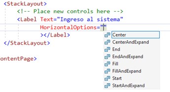
58.	Utilizamos Center and expand para que utilice todo el espacio que haya en la pantalla.
59.	Creamos un StackLayout y le damos orientación horizontal e incluimos el label del titulo allí, y cambiamos el backgoud al Stacklayout.
60.	Le colocamos un color al texto
```<language>
61.	 62.	        <!--Cuerpo del formulario -->
63.	        <StackLayout VerticalOptions="CenterAndExpand">
64.	            <Label Text="Usuario"></Label>
65.	            <Entry x:Name="eUsuario" Placeholder="Digite su Usuario">
66.	            </Entry>
67.	            <Label Text="Clave"></Label>
68.	            <Entry x:Name="eClave" Placeholder="Digite su Clave"
69.	                   Keyboard="Numeric"
70.	                   ></Entry>
71.	            <Button x:Name="BtnAutenticar" Text="Autenticar"
72.	                    BorderRadius="20" BorderWidth="40"
73.	                    BackgroundColor="LightGreen"
74.	                    ></Button>
75.	        </StackLayout>76.	
77.	Cambiamos el código del Stack Layout por el que aparece en el fragmento anterior, esto se vera de la siguiente manera en la pantalla de VS.
```
78.	 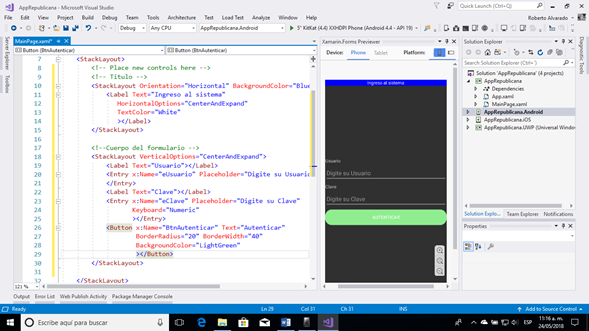
79.	Aquí con esta pantalla podremos ir viendo como se ve nuestra pantalla antes de ejecutar el aplicativo.
80.	Veamos cómo se ve ejecutando nuestro app.
81.	Digitamos un usuario y una clave:
82.	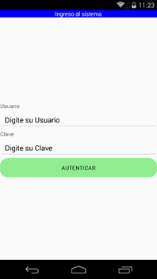  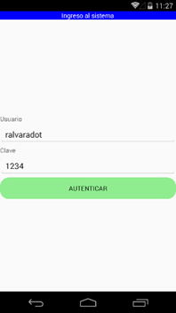
83.	Vamos a darle funcionalidad a nuestro boton inluimos un atributo Clicked que es el evento click del boton, 
84.	 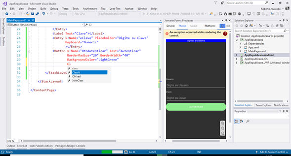
85.	 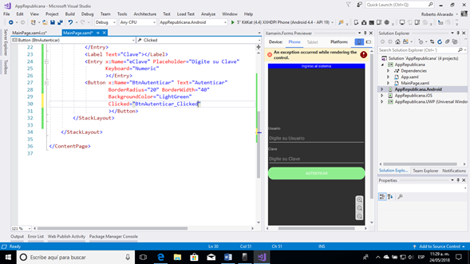
86.	Visual Studio nos genera el nombre del método a ejecutar en el evento clic del botón y nos abre la ventana de código C# o Code Behind para escribir el código en C#. 
87.	 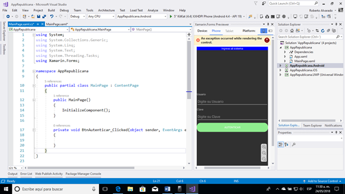
88.	Observamos en el recuadro rojo que nos muestra la plantilla del evento clic del botón.
89.	Aquí colocaremos el código para llamar a otra pantalla de nuestra app.
```<language>
private void BtnAutenticar_Clicked(object sender, EventArgs e)
{
    this.Navigation.PushAsync();
}
```
90.	Como observamos el método termina en Async, esto indica que es un método asincrónico, para que la aplicación continúe su ejecución sin esperar la respuesta de la acción a realizar. 
91. 

```<language>
private async void BtnAutenticar_Clicked(object sender, EventArgs e)
{
    await this.Navigation.PushAsync();
}
```
92.	
93.	Ahora nos toca crear una nueva pantalla para llamarla y colocarla como parámetro al método PushAsync.
94.	Damos clic derecho en el proyecto NET estándar y seleccionamos Add
95.	 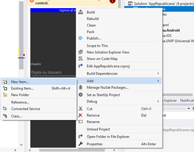
96.	Esto abre una nueva pantalla que permite que creemos nuestra pantalla
97.	 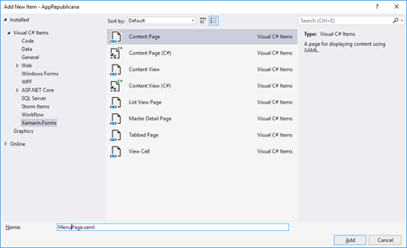
98.	En la parte izquierda ubicamos Xamarin Forms, en el centro ubicamos Content Page, en la parte inferior colocamos el nombre de nuestra pantalla y en la parte derecha inferior damos clic al botón Add para adicionar la pantalla.
99.	Adicionamos el código para llamar a la pantalla nueva
```<language>
100.	await this.Navigation.PushAsync(new MenuPage());
```
101.	Abrimos la pantalla creada y la modificamos de acuerdo a lo que se necesita.
102.	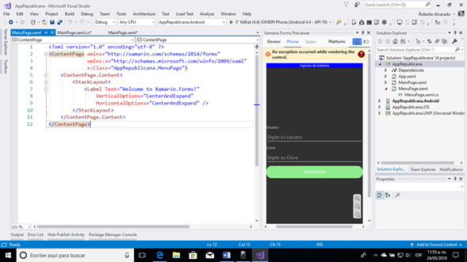
103.	Ejecutamos
104.	Creamos nuestras pantallas de acuerdo con los botones de nuestra pantalla de Menú, ahora damos clic derecho en el nombre del proyecto NET Standard, le damos clic al botón Add, New Item, y nos muestra la siguiente pantalla.
105.	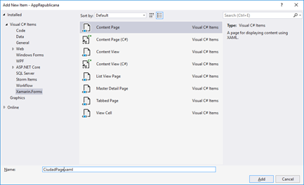
106.	En la parte izquierda seleccionamos Xamarin.Forms, en la parte central ubicamos Content Page, colocamos en nombre en la caja de texto de la parte inferior y por último, damos clic en el botón Add y se crea el nuevo formulario.
107.	Esto nos crea la página de la siguiente manera:
108.	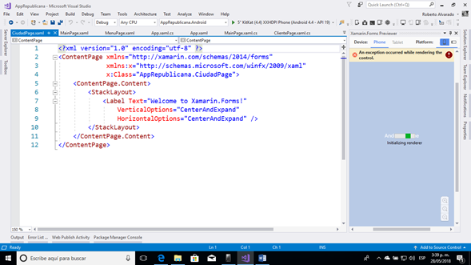
109.	Le adicionamos en la parte superior el atributo de título a la página. 
110.	
111.	Creamos también ClientePage, PedidoPage y ProductoPage, con esto crearemos 4 pantallas diferentes que se llamaran desde la página de Menú.
112.	Ahora vamos a configurar la Navegación de nuestra App
113.	Lo primero es ir a la primera página que llamamos, que es la página MainPage, y en la vista de XAML, recuerde agregar el atributo Title, debe quedar similar a los siguiente:
```<language>
<?xml version="1.0" encoding="utf-8" ?>
<ContentPage xmlns="http://xamarin.com/schemas/2014/forms"
             xmlns:x="http://schemas.microsoft.com/winfx/2009/xaml"
             xmlns:local="clr-namespace:AppRepublicana"
             x:Class="AppRepublicana.MainPage"
114.	             Title="Ingreso al sistema">
```
115.	Ahora vamos al archivo App.xaml.cs para correguir algunas cosas y que nos empiece a funcionar como debe la navegación.
```<language>
public App ()
{
	InitializeComponent();

	MainPage = new NavigationPage(new MainPage());
116.	}
```
117.	Como se aprecia el llamado ahora es con un new NavigationPage y se le pasa como parámetro la página que deseamos muestre inicialmente, en nuestro caso será la página de login.
118.	Al ejecutar después de estos cambios, veremos los siguiente:
119.	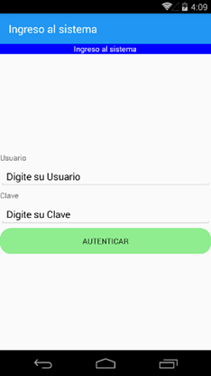  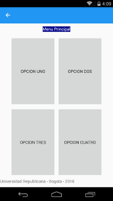
120.	Observamos que en la parte superior izquierda aparece una flecha de atrás, en Android la podremos eliminar, pero para iOS es necesaria pues en iOS no hay un botón hardware de atrás.
121.	Vamos a eliminar el label con el título y el titulo lo colocamos en la parte superior de la barra de navegación.
```<language>
<ContentPage xmlns="http://xamarin.com/schemas/2014/forms"
             xmlns:x="http://schemas.microsoft.com/winfx/2009/xaml"
             x:Class="AppRepublicana.MenuPage">
    <ContentPage.Content>
        <Grid>
            <Grid.RowDefinitions>
                <RowDefinition Height="40" 
                               ></RowDefinition>
                <RowDefinition Height="*"></RowDefinition>
                <RowDefinition Height="30"></RowDefinition>
            </Grid.RowDefinitions>
            <StackLayout Orientation="Horizontal" 
                         Grid.Row="0"
                         BackgroundColor="DarkBlue"
                         VerticalOptions="Center"
                         HorizontalOptions="Center">
                <Label Text="Menu Principal" 
                       TextColor="White"
                       ></Label>
122.	            </StackLayout>
```
123.	En amarillo tenemos el label el cual vamos a eliminar y en la parte superior colocamos el text del label en la propiedad Title. De acuerdo a esto ahora se verá asi:
```<language>
<?xml version="1.0" encoding="utf-8" ?>
<ContentPage xmlns="http://xamarin.com/schemas/2014/forms"
             xmlns:x="http://schemas.microsoft.com/winfx/2009/xaml"
             x:Class="AppRepublicana.MenuPage"
124.	             Title="Menu Principal">
```
125.	Ahora ejecutamos nuestro App y veremos las diferentes pantallas que hemos creado, asi como los botones que acabamos de modificar el texto.
126.	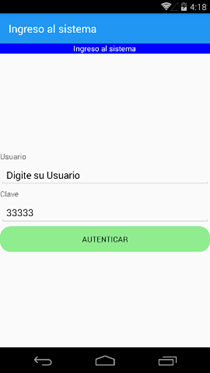   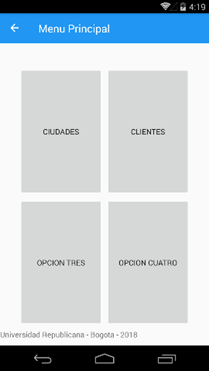
127.	Ahora vamos a darle un margen a la primera pantalla, y a que los botones de la pantalla menú se vean diferentes y le colocamos los eventos para que llamen a las otras páginas que hemos creado.
128.	Lo primero a nuestra página MainPage le cambiamos el título:
```<language>
<ContentPage xmlns="http://xamarin.com/schemas/2014/forms"
             xmlns:x="http://schemas.microsoft.com/winfx/2009/xaml"
             xmlns:local="clr-namespace:AppRepublicana"
             x:Class="AppRepublicana.MainPage"
129.	             Title="App Universidad Republicana">
```
130.	Ahora vamos a darle un margen a la página para que no se vean los textos pegados a la izquierda, para esto en el StackLayout principal usaremos el atributo Padding y le daremos 20 como valor a la propiedad para el espacio que deseamos.
```<language>
131.	    <StackLayout Padding="20">
132.	        <!-- Place new controls here -->
133.	        <!-- Titulo -->134.	
```
135.	Si ejecutamos ahora se vera de la siguiente forma:
136.	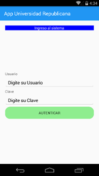
137.	Como se aprecia en la imagen se mucho mejor ahora con los espacios alrededor del StackPanel.
138.	Para modificar el aspecto de los botones del menú crearemos lo que se conoce como un Estilo, en XAML, esto lo haremos en el archivo App.xaml.
```<language>
<?xml version="1.0" encoding="utf-8" ?>
<Application xmlns="http://xamarin.com/schemas/2014/forms"
             xmlns:x="http://schemas.microsoft.com/winfx/2009/xaml"
             x:Class="AppRepublicana.App">
	<Application.Resources>
        <ResourceDictionary>
            <Style TargetType="Button">
                <Setter Property="BorderRadius" Value="20"></Setter>
                <Setter Property="BorderWidth" Value="40"></Setter>
                <Setter Property="BackgroundColor" Value="DarkOrange"></Setter>
            </Style>
        </ResourceDictionary>
	</Application.Resources>
139.	</Application>
```
140.	Ahora adicionamos el resourceDictionary y dentro los estilos que vayamos creando, en este caso este estilo es general a todos los botones de la aplicación, este es un estilo global y para todo botón que se adicione al App.
141.	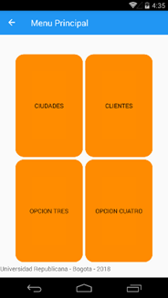
142.	Pero los valores de altura del botón siguen llenando todo el espacio disponible, coloquemos en el estilo una altura a los botones y volvamos a ejecutar.
```<language>
143.	  <Style TargetType="Button">
144.	      <Setter Property="BorderRadius" Value="20"></Setter>
145.	      <Setter Property="BorderWidth" Value="40"></Setter>
146.	      <Setter Property="BackgroundColor" Value="DarkOrange"></Setter>
147.	      <Setter Property="HeightRequest" Value="40"></Setter>
148.	  </Style>
    149.	
```
150.	Ahora nos toca ir a la pantalla de MenuPage y agregar unos Stacklayout y colocar dentro los botones, y cambiar los Grid.Column y Grid.Row en cada StackLayout y quitarlos de los botones. Nuestro código xaml debe quedar de la siguiente manera:
```<language>
                <StackLayout Grid.Column="1" Grid.Row="0">
                    <Button x:Name="BtnUno" Text="Ciudades" 
                        Clicked="BtnUno_Clicked"
                        ></Button>
                </StackLayout>
                <StackLayout Grid.Column="2" Grid.Row="0">
                    <Button x:Name="BtnDos" Text="Clientes" 
                        ></Button>
                </StackLayout>
                <StackLayout Grid.Column="1" Grid.Row="1">
                    <Button x:Name="BtnTres" Text="Opcion Tres" 
                        ></Button>
                </StackLayout>
                <StackLayout Grid.Column="2" Grid.Row="1">
                    <Button x:Name="BtnCuatro" Text="Opcion Cuatro" 
                        ></Button>
151.	         </StackLayout>
```
152.	Ejecutemos y veamos cómo se ve nuestra App.
153.	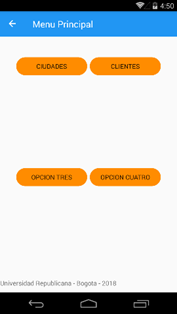
154.	Adicionemos los eventos Clicked a los botones y coloquemos el código a cada uno de ellos.
```<language>
<StackLayout Grid.Column="1" Grid.Row="0">
    <Button x:Name="BtnUno" Text="Ciudades" 
        Clicked="BtnUno_Clicked"
        ></Button>
</StackLayout>
<StackLayout Grid.Column="2" Grid.Row="0">
    <Button x:Name="BtnDos" Text="Clientes" 
            Clicked="BtnDos_Clicked"
        ></Button>
</StackLayout>
<StackLayout Grid.Column="1" Grid.Row="1">
    <Button x:Name="BtnTres" Text="Productos" 
            Clicked="BtnTres_Clicked"
        ></Button>
</StackLayout>
<StackLayout Grid.Column="2" Grid.Row="1">
    <Button x:Name="BtnCuatro" Text="Pedidos" 
            Clicked="BtnCuatro_Clicked"
        ></Button>
155.	</StackLayout>
```
156.	Ahora ya tenemos cada botón con un evento, vamos al código C# y llamemos a cada uno de las formularios que creamos antes.
157.	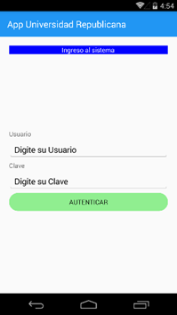  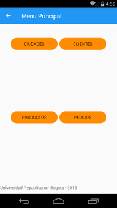
158.	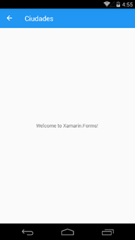  
159.	  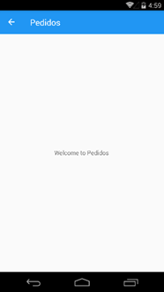
160.	Hasta aquí ya hemos probado y verificado la navegación de nuestro App, ahora vamos a corregir algunos aspectos de visualización, por ejemplo, los botones del menú principal están en la parte superior de la celada en el Grid, centrémoslos verticalmente, para que se vean mejor.
```<language>
<StackLayout Grid.Column="1" Grid.Row="0" VerticalOptions="Center">
    <Button x:Name="BtnUno" Text="Ciudades" 
        Clicked="BtnUno_Clicked"
        ></Button>
</StackLayout>
<StackLayout Grid.Column="2" Grid.Row="0" VerticalOptions="Center">
    <Button x:Name="BtnDos" Text="Clientes" 
            Clicked="BtnDos_Clicked"
        ></Button>
</StackLayout>
<StackLayout Grid.Column="1" Grid.Row="1" VerticalOptions="Center">
    <Button x:Name="BtnTres" Text="Productos" 
            Clicked="BtnTres_Clicked"
        ></Button>
</StackLayout>
<StackLayout Grid.Column="2" Grid.Row="1" VerticalOptions="Center">
    <Button x:Name="BtnCuatro" Text="Pedidos" 
            Clicked="BtnCuatro_Clicked"
        ></Button>
161.	</StackLayout>
```
162.	A cada uno de los StackLayout que contienen los botones, le agregamos el atributo VerticalOptions y le asignamos el valor Center, con esto el aspecto de esta pantalla mejora mucho.
163.	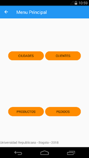
164.	Ya que tenemos desarrollada la pantalla de Clientes, vamos a mejorar su presentación, para ello vamos a crear un Grid y a incluir los controles que ya hemos visto en este Grid para que armonice el ancho de columnas de la izquierda y el de la derecha las cajas de texto, además, eliminaremos el label con el título, pues ya en la barra de navegación tenemos el título.
165.	Vamos a cambiar el código XAML por el siguiente:
```<language>
<Grid Padding="10">
    <Grid.RowDefinitions>
        <RowDefinition Height="30"></RowDefinition>
        <RowDefinition Height="30"></RowDefinition>
        <RowDefinition Height="30"></RowDefinition>
        <RowDefinition Height="30"></RowDefinition>
        <RowDefinition Height="30"></RowDefinition>
        <RowDefinition Height="30"></RowDefinition>
        <RowDefinition Height="30"></RowDefinition>
    </Grid.RowDefinitions>
    <Grid.ColumnDefinitions>
        <ColumnDefinition Width="80"></ColumnDefinition>
        <ColumnDefinition Width="*"></ColumnDefinition>
    </Grid.ColumnDefinitions>

    <Label Text="NIT: "
               Grid.Row="0" Grid.Column="0"
               ></Label>
    <Entry x:Name="ENit" Placeholder="Nit del cliente"
               Grid.Row="0" Grid.Column="1"
               Keyboard="Numeric"></Entry>

    <Label Text="Razon Social: "
               Grid.Row="1" Grid.Column="0"
               ></Label>
    <Entry x:Name="ERazon" Placeholder="Razon social"
               Grid.Row="1" Grid.Column="1"
               Keyboard="Text"></Entry>

    <Label Text="Contacto: "
           Grid.Row="2" Grid.Column="0"
           ></Label>
    <Entry x:Name="EContacto" Placeholder="Nombre contacto"
               Grid.Row="2" Grid.Column="1"
               Keyboard="Text"></Entry>

    <Label Text="Email: "
               Grid.Row="3" Grid.Column="0"
               ></Label>
    <Entry x:Name="EEmail" Placeholder="Correo electronico"
               Grid.Row="3" Grid.Column="1"
               Keyboard="Email"></Entry>

    <Label Text="Celular: "
               Grid.Row="4" Grid.Column="0"
               ></Label>
    <Entry x:Name="ECelular" Placeholder="Numero del celular"
               Grid.Row="4" Grid.Column="1"
               ></Entry>

    <Button x:Name="BtnGrabar" Text="Guardar"
                Grid.Row="5" Grid.Column="1"
            ></Button>

166.	</Grid>
```
167.	Ahora ejecutamos y vemos como se ve nuestro App
168.	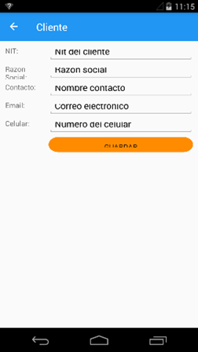
169.	Se aprecia que las letras están recortadas en la parte superior, asi que vamos a aumentar el alto de las filas.
```<language>
<Grid.RowDefinitions>
    <RowDefinition Height="40"></RowDefinition>
    <RowDefinition Height="40"></RowDefinition>
    <RowDefinition Height="40"></RowDefinition>
    <RowDefinition Height="40"></RowDefinition>
    <RowDefinition Height="40"></RowDefinition>
    <RowDefinition Height="40"></RowDefinition>
    <RowDefinition Height="40"></RowDefinition>
170.	</Grid.RowDefinitions>
```
171.	Después del ajuste, nuestra pantalla se ve asi:
172.	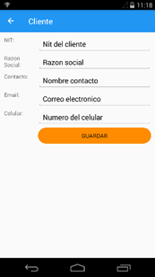
173.	


